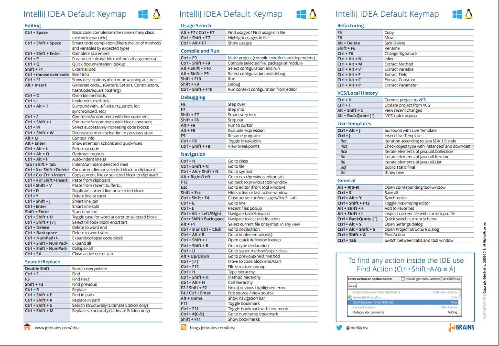

### Intellij IDEA 快捷键

>  官方英文快捷键大全
>  这张图在Intellij IDEA 的里面就可以找到：`Help`->`Default Keymap Reference`

 

### Intellij IDEA 快捷键的分析
 > 根据官网英文快捷键谱上大概一共133个（只限图上的快捷键，一行记为一个快捷键，不包括鼠标和快捷键组合的快捷键）
 > 根据功能区域区分来初步统计

| 功能区域        | 说明   |  数量  |百分比  |
| --------   | -----  | ---- | ---- |
| Editing             | 编辑区域                            |  40    |` 29.86%  ` |
| Search/Replace      | 查找，替换区域                       |  9    | 6.73%   |
| Usage Search        | 搜索变量,方法,类，文件等在哪里被使用过  |  3     | 2.23%  |
| Complie and Run     |编译和运行区域                        |  7     | 5.22%      |
| Debugging           |Debgging 调试区域                     |  9    | 6.73%    |
| Navigation          |    导航                             |  30    | `22.30% `  |
| Refactoring         |   重构                              |  11    | 8.21%   |
| VCS/Local History   |    版本控制和本地历史记录              |  4    | 2.99%      |
| Live Templates      |    动态模板                          |  9    | 6.73%   |
| General             |    公共                              |  11   | 8.22%   |

 > 说明：从上图可以看出，大部分快捷集中分布在编辑区域和导航区域。

 > 根据辅助组合键类型区分来统计

| 辅助组合键类型        | 主要用途   |  分布主要区域  |使用率  |
| --------   | -----  | ---- | ---- |
| Ctrl             | 编辑代码，导航，查找，替换                         |  Editing,Search/Replace,Debugging,Navigation |` 极高 ` |
| Alt              |     生产代码，快速修复问题，视图切换，列编辑                        |  Editing,Debugging,Navigation,     |` 极高 ` |
| Shift            |     调试，导航                      |  Debugging,Navigation    |一般 |
| Ctrl+Alt        | 重构，导航，公共                         |  Refactoring,Navigation,General  | 一般  |
| Ctrl+Shift      | 代码提示，查找，替换，搜索，编译，导航，                  | Editing,Search/Replace,Usage Search,Compile,Navigation,Refactoring,General   | ` 极高 ` |
| Alt+Shift       |   列编辑，查看当前视图的改变                      | VCS/Local History    | 一般 |

 > 说明：记住上面的辅助组合键再加上相应的字母，这样一个快捷键就生成了，也非常容易记住。

 ### 记忆的策略
 >  1.记忆快捷键的时候，直接看官网英文的快捷键的图谱进行记忆，不看要看中文翻译过的快捷键图谱，这样利于记忆。
 >  2.根据快捷键的英文说明，记住关键单词来进行记忆。
 例如重构区域的快捷键，10秒钟记住5个不是梦想，观察下面的快捷键，你会发现，基本的辅助组合键加上字母，这些字母都是英文说明的中某一个重要单词的首字母，
 记住这些英文单词，分分钟记住这些快捷键，印象深刻，不容易忘记，就是忘记，也很容易能回想起来。如果根据中文翻译后的说明来记忆，你可不一定一下记得住这5个快捷键，而且容易忘记。

| 快捷键        | 英文说明   | 中文说明  |
| --------   | -----  |-----  |
| Ctrl+ALt+M | Extract `M`ethod     |提取方法|
| Ctrl+ALt+V | Extract `V`ariable   |提取变量|
| Ctrl+ALt+F | Extract `F`ield      |提取字段|
| Ctrl+ALt+C | Extract `C`onstant   |提取常量|
| Ctrl+ALt+P | Extract `P`arameter  |提取参数|

 > 3.按需记忆，根据自己的实际情况去记忆快捷键。想一口气吃成胖子，既不现实，也没什么效果。

